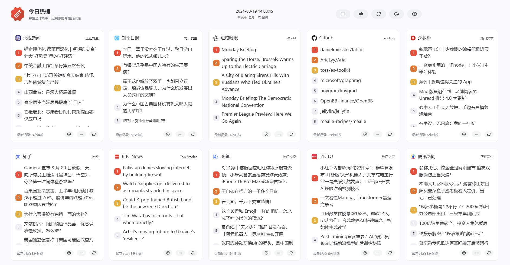

<div align="center">

<h2>今日热榜</h2>
<p>掌握全球热点，定制你的专属资讯源</p>
<br />

</div>


## 示例

> 这里是示例站点

- [今日热榜 - http://hotnews.nice-stuff.rocks/#/](http://hotnews.nice-stuff.rocks/#/)

## 更新

在原有基础上增加时间线功能，并且增加RSS订阅功能
## 部署

```bash
// 安装依赖
pnpm install

// 开发
pnpm dev

// 打包
pnpm build
```


